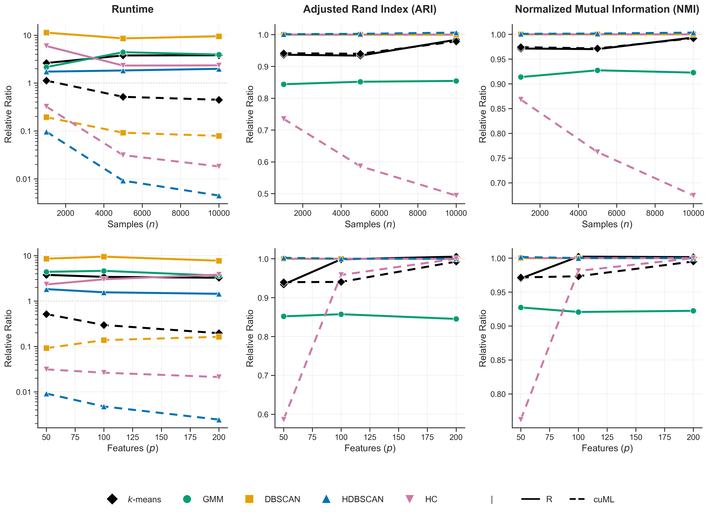

# Cross-Platform Clustering Benchmarks

This repository benchmarks five clustering algorithms across three backends:

- **scikit-learn** on CPU;
- **R** on CPU; and
- **RAPIDS cuML** on an NVIDIA GPU.

The evaluation uses shared synthetic datasets and reports runtime, Adjusted Rand Index (ARI), and normalized mutual information (NMI). The `results/` directory contains the benchmark outputs for the analysis. To limit the repository size, the generated datasets are not included; they can
be reproduced using `generate_data.py`.



*Figure. Mean runtime, ARI, and NMI ratios relative to the scikit-learn CPU baseline. The top row varies sample sizes $n$ with \(p=50\); the bottom row varies feature dimensions with \(n=5{,}000\). Solid lines denote R and dashed lines denote cuML. For runtime, a ratio below 1 indicates a faster implementation than scikit-learn; for ARI and NMI, a ratio near 1 indicates similar clustering agreement.*

## Benchmark design

Each dataset has five approximately equally sized clusters. Data are generated
with `sklearn.datasets.make_blobs`, using cluster-specific standard deviations
from 1 to 10 and additional Gaussian feature noise (standard deviation 1).
Each configuration has 100 independently seeded replicates.

| Sweep | Samples \(n\) | Features \(p\) | Configurations |
| --- | ---: | ---: | --- |
| Vary sample size | 1,000; 5,000; 10,000 | 50 | 3 |
| Vary feature size | 5,000 | 50; 100; 200 | 3, with \(n=5{,}000, p=50\) shared with the first sweep |

Thus, the repository contains five unique \((n,p)\) configurations and 500
replicate datasets in total.

## Methods and implementations

| Method | scikit-learn (CPU) | R (CPU) | cuML (GPU) |
| --- | :---: | :---: | :---: |
| $k$-means | `KMeans` | `stats::kmeans` | `KMeans` |
| Gaussian mixture model (GMM) | `GaussianMixture` | `mclust::me` (VII model) | — (Not Supported) |
| DBSCAN | `DBSCAN` | `dbscan::dbscan` | `DBSCAN` |
| HDBSCAN | `HDBSCAN` | `dbscan::hdbscan` | `HDBSCAN` |
| Hierarchical clustering (HC) | `AgglomerativeClustering` (Ward linkage) | `stats::hclust` (`ward.D2`) | `AgglomerativeClustering` (single linkage) |


All methods use the common true labels for evaluation. ARI and NMI use the
scikit-learn metric definitions, with arithmetic NMI normalization, including
for the R benchmark through `reticulate`.

## Repository layout

| Path | Purpose |
| --- | --- |
| `generate_data.py` | Generates the shared `.npz` replicate datasets and a `config.json` for each configuration. Generated data are in `data/`. |
| `benchmark_sklearn_cpu.py` | Runs CPU scikit-learn benchmarks. |
| `benchmark_cuml_gpu.py` | Runs available cuML GPU benchmarks. |
| `benchmark_R_cpu_updated.R` | Runs R CPU benchmarks. |
| `summarize_results.ipynb` | Merges CSV outputs, calculates mean backend-to-scikit-learn ratios, prints comparison tables, and creates the figure. |
| `data/` | Input datasets arranged as `n_<n>_p_<p>/`, each with `config.json` and `replicate_<i>.npz`. |
| `results/` | CSV outputs produced by the benchmark scripts. |
| `clustering_performance.png` | Relative-performance figure generated by the notebook. |

## Reproducing the analysis

Run commands from the repository root.

### 1. Generate the datasets

The included benchmark scripts expect datasets under `data/`. Run:

```bash
python generate_data.py
```

### 2. Run the benchmarks

Run the implementations:

```bash

# Python / CPU
python benchmark_sklearn_cpu.py

# Python / NVIDIA GPU (requires a CUDA-compatible RAPIDS installation)
python benchmark_cuml_gpu.py

# R / CPU
Rscript benchmark_R_cpu_updated.R
```

### 3. Summarize and plot

Open and run all cells in `summarize_results.ipynb`. It reads every CSV in `results/`, averages each metric over replicates within a \((n,p,\text{algorithm},\text{backend})\) group, and divides each R or cuML mean by the corresponding scikit-learn mean. It writes `clustering_performance.png` and prints ratio tables.

## Output files

The scripts write one replicate-level CSV per method, for example:

```text
results/python_kmeans_cpu_results.csv
results/python_kmeans_gpu_results.csv
results/r_kmeans_results.csv
```

Replicate-level files contain the sample size, feature count, replicate ID, runtime in seconds, ARI, and NMI.

## Software environments

### Python

- Python 3.12.0
- `numpy` 2.0.1
- `pandas` 2.3.3 
- `scikit-learn` 1.8.0
- `matplotlib` 3.10.9, `seaborn` 0.13.2, and Jupyter (for `summarize_results.ipynb`)
- `CuPy` 14.0.1 and `cuML` 26.04.000 for the GPU benchmark

### R

- R 4.6.0
- `reticulate` 1.46.0
- `mclust` 6.1.3
- `dbscan` 1.2.5
- `jsonlite` 2.0.0

The R benchmark calls Python's `numpy` and `scikit-learn` through `reticulate`, so the R session must be configured to use a Python environment containing those two packages. cuML requires an NVIDIA GPU and a RAPIDS/CUDA installation compatible with the host driver.

> **Note:** Installing cuML requires compatible RAPIDS, CUDA, Python, and NVIDIA driver versions. Refer to the official [RAPIDS Installation Guide](https://docs.rapids.ai/install/) when setting up the GPU environment.
